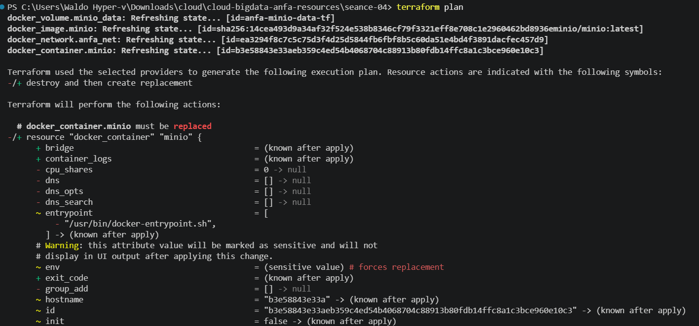
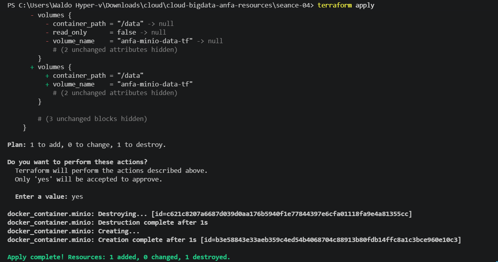
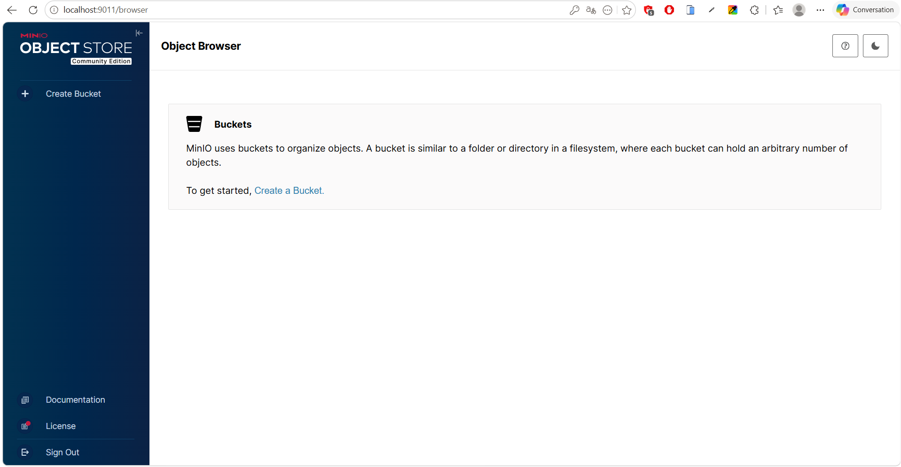
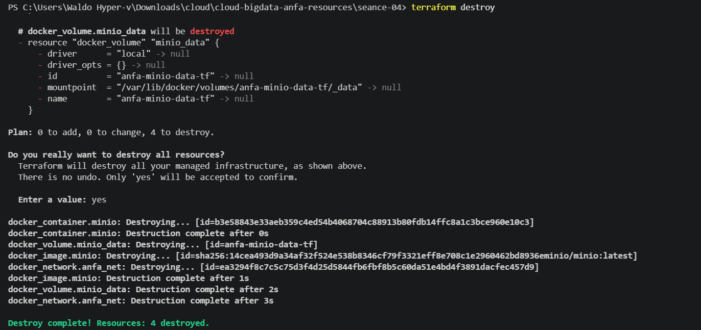

# Rendu Séance 4

**Nom et prénom :** Nancy Montcho
**Identifiant GitHub :** MontchoNancy

## Résumé de la séance

Cette quatrième séance introduit Terraform comme outil d'Infrastructure as Code pour décrire, appliquer et détruire une infrastructure Docker de façon reproductible et versionnée. Après avoir manipulé Docker Compose puis Kubernetes lors des séances précédentes, j'ai découvert comment Terraform permet de décrire une infrastructure en HCL et de la gérer via un cycle `init` → `plan` → `apply` → `destroy`, en s'appuyant sur un fichier `state` qui mémorise ce qui a réellement été créé. J'ai construit progressivement une stack complète (réseau, volume, conteneur MinIO) pour le projet Anfa, d'abord en dur puis paramétrée avec des variables, et observé concrètement comment Terraform applique des changements incrémentaux sans tout recréer.

## Étapes principales

1. Installation de Terraform (v1.15.7) sur Windows par téléchargement du binaire, copie dans `C:\terraform\`, et ajout au PATH.
2. Création de la branche `seance-04` et du dossier de travail `seance-04/`.
3. Écriture d'un premier `main.tf` minimal pour créer un seul conteneur MinIO, et apprentissage du workflow `terraform init` → `terraform plan` → `terraform apply` → `terraform destroy`.
4. Observation et compréhension du fichier `terraform.tfstate` : son contenu JSON, les secrets qu'il contient en clair, et pourquoi il ne doit jamais être commité.
5. Vérification de l'idempotence (`terraform apply` répété sans rien changer → "No changes").
6. Mise en place du `.gitignore` spécifique Terraform (`.terraform/`, `*.tfstate`, `*.tfvars` sauf `*.tfvars.example`).
7. Construction de la stack complète : réseau `anfa-network`, volume `anfa-minio-data-tf`, conteneur MinIO avec `restart` policy, montés ensemble.
8. Test d'un changement incrémental (modification du mot de passe MinIO) et observation du remplacement du conteneur (recréation) sans perte de données grâce à la persistance du volume.
9. Refactoring du code avec `variables.tf`, `terraform.tfvars` (secret, ignoré par Git) et `terraform.tfvars.example` (modèle versionné).
10. Destruction propre de toute l'infrastructure et vérification (`docker ps`, `docker network ls`, `docker volume ls`).
11. Rédaction de ce `RENDU.md` et push sur la branche `seance-04`.

## Difficultés rencontrées

- **`terraform` non reconnu après installation manuelle** : contrairement à `winget`, l'installation manuelle par téléchargement du zip ne configure pas automatiquement le PATH. Résolu en plaçant `terraform.exe` dans `C:\terraform\` et en l'appelant directement via le chemin complet (`& "C:\terraform\terraform.exe"`) le temps que le PATH soit correctement pris en compte dans une nouvelle session.

- **Commandes `grep` et `ls -la` non reconnues sous PowerShell** : ce sont des commandes Linux/Bash absentes de PowerShell. Résolu en utilisant leurs équivalents natifs : `Select-String` à la place de `grep`, et `Get-ChildItem -Force` à la place de `ls -la`.

- **Erreur de syntaxe HCL (`Invalid character`)** : une ligne parasite (`@MontchoNancy`) s'était glissée par erreur dans `variables.tf`, probablement lors d'un copier-coller, provoquant l'échec de `terraform init`. Résolu en supprimant la ligne fautive et en vérifiant la cohérence du fichier.

- **`terraform destroy` bloqué par des conteneurs orphelins (`must be forced`)** : d'anciens conteneurs MinIO (issus de séances précédentes, non gérés par ce Terraform) utilisaient encore l'image `minio/minio:latest`, empêchant sa suppression. Résolu en identifiant ces conteneurs avec `docker ps -a` et en les supprimant manuellement avec `docker rm -f <id>` avant de relancer `terraform destroy`.

- **Variables manquantes (`Reference to undeclared input variable`)** : après correction du fichier `variables.tf`, les variables `network_name` et `volume_name` utilisées par `main.tf` avaient disparu du fichier de variables fourni par le gist. Résolu en les ajoutant manuellement à `variables.tf`.

## Captures d'écran

### terraform plan (création initiale)


### terraform apply réussi


### Console MinIO créée par Terraform


### terraform destroy


## Exercices d'application

### Exercice 1 : QCM conceptuel

**1.1** Réponse : **B** — L'IaC remplace totalement la nécessité de comprendre l'infrastructure sous-jacente.
Justification : c'est faux ; l'IaC facilite la gestion de l'infrastructure mais ne dispense pas de comprendre les concepts sous-jacents (réseau, stockage, sécurité), car un mauvais code reproduit fidèlement une mauvaise architecture.

**1.2** Réponse : **B** — Le déclaratif décrit l'état souhaité ; l'impératif décrit la séquence d'actions à effectuer.
Justification : Terraform (déclaratif) décrit l'état final voulu et laisse l'outil calculer comment y parvenir, alors qu'une approche impérative décrit la suite exacte d'actions à exécuter.

**1.3** Réponse : **B** — Elle produit le même résultat quel que soit le nombre de fois où elle est appliquée.
Justification : c'est la définition de l'idempotence ; appliquer plusieurs fois la même opération ne crée pas d'effet de bord cumulatif.

**1.4** Réponse : **B** — À fournir un plugin qui sait communiquer avec une API spécifique (AWS, Docker, Kubernetes…).
Justification : un provider traduit le HCL en appels concrets à l'API de la plateforme cible.

**1.5** Réponse : **B** — Terraform compare le state au code, ne voit aucun écart, et n'effectue aucune action.
Justification : c'est le principe d'idempotence appliqué au workflow ; sans écart entre state et configuration, Terraform affiche "No changes".

**1.6** Réponse : **C** — Mémoriser ce que Terraform a créé pour pouvoir suivre les changements incrémentaux.
Justification : le state stocke les IDs et attributs réels des ressources créées, ce qui permet à Terraform de calculer les écarts lors d'un `plan`.

**1.7** Réponse : **B** — Parce qu'il peut contenir des secrets en clair (mots de passe, clés API) et peut être corrompu par des commits concurrents.
Justification : observé concrètement en Partie 3 du TP, le mot de passe MinIO apparaissait en clair dans `terraform.tfstate`.

**1.8** Réponse : **C** — `terraform plan`.
Justification : cette commande affiche les changements prévus sans rien appliquer, le réflexe fondamental avant tout `apply`.

**1.9** Réponse : **B** — Un fork open source de Terraform créé après le changement de licence de HashiCorp en 2023.
Justification : HashiCorp est passé à une licence BSL non-open-source, ce qui a conduit la communauté à créer OpenTofu.

**1.10** Réponse : **B** — Non, Terraform provisionne l'infrastructure, Ansible configure des machines existantes — ils sont complémentaires.
Justification : Terraform crée les ressources (machines, réseaux, volumes), Ansible intervient ensuite pour configurer ce qui existe déjà ; les deux sont souvent utilisés ensemble dans une même chaîne de déploiement.

---

### Exercice 2 : Lecture et interprétation d'un fichier Terraform

**2.1 Les 4 resources définies**

| Resource | Rôle |
|---|---|
| `docker_network.back` | Crée le réseau Docker `anfa-backend` qui isolera la communication entre conteneurs. |
| `docker_volume.data` | Crée le volume Docker `postgres-data` pour persister les données de la base. |
| `docker_image.postgres` | Télécharge/référence l'image `postgres:15`. |
| `docker_container.db` | Crée le conteneur `anfa-postgres`, le connecte au réseau et au volume, et l'exécute avec ses variables d'environnement. |

**2.2** `docker_image.postgres.image_id` référence dynamiquement l'ID de l'image effectivement construite/téléchargée par la resource `docker_image.postgres`. Par rapport à écrire `image = "postgres:15"` en dur, cela crée une **dépendance explicite** entre les deux resources : Terraform sait qu'il doit créer l'image avant le conteneur, et si l'image change (nouvelle version, nouveau digest), le conteneur sera automatiquement recréé pour rester cohérent.

**2.3** Terraform créera dans cet ordre : `docker_network.back`, `docker_volume.data` et `docker_image.postgres` en premier (aucune dépendance entre elles, donc potentiellement en parallèle), puis `docker_container.db` en dernier, car il référence les trois autres via `docker_network.back.name`, `docker_volume.data.name` et `docker_image.postgres.image_id`. Terraform construit un graphe de dépendances à partir de ces références et respecte cet ordre automatiquement.

**2.4** Le problème principal : le mot de passe `POSTGRES_PASSWORD=secret123` est écrit **en clair directement dans le code**, qui sera potentiellement commité dans Git. Correction : extraire ce mot de passe dans une variable sensible.

```hcl
variable "postgres_password" {
  description = "Mot de passe administrateur PostgreSQL"
  type        = string
  sensitive   = true
}

resource "docker_container" "db" {
  # ...
  env = [
    "POSTGRES_DB=anfa",
    "POSTGRES_USER=anfa_user",
    "POSTGRES_PASSWORD=${var.postgres_password}",
  ]
  # ...
}
```
La valeur réelle serait alors fournie via `terraform.tfvars`, fichier exclu du `.gitignore`.

**2.5** Après `terraform destroy`, le state est vide : plus aucune ressource n'est gérée. En modifiant `external = 5432` en `5433` puis en relançant `terraform apply`, Terraform ne trouve aucune ressource existante dans le state : il va donc **tout créer depuis zéro** (réseau, volume, image, conteneur), cette fois avec le port externe 5433. Il n'y a pas de "modification" possible puisque rien n'existe plus à modifier — c'est une création complète et normale après une destruction totale.

---

### Exercice 3 : Diagnostic

**3.1 L'apply qui échoue avec une dépendance circulaire**

a. **Signification de l'erreur** : Terraform a détecté un **cycle** dans le graphe de dépendances : `docker_container.a` dépend de `docker_container.b` (via `docker_container.b.name`), et `docker_container.b` dépend en retour de `docker_container.a`. Aucun ordre de création ne peut satisfaire les deux dépendances simultanément.

b. **Pourquoi Terraform refuse** : Terraform construit un graphe orienté acyclique (DAG) pour déterminer l'ordre de création des resources. Un cycle rend ce graphe impossible à résoudre, puisque chacune des deux resources attend une information de l'autre qui n'existe pas encore.

c. **Solution** : casser la dépendance circulaire en n'utilisant pas de référence dynamique à l'autre resource, mais un nom fixe et connu à l'avance :

```hcl
resource "docker_container" "a" {
  name  = "container-a"
  image = "alpine"
  env   = ["LINKED_TO=container-b"]
}

resource "docker_container" "b" {
  name  = "container-b"
  image = "alpine"
  env   = ["LINKED_TO=container-a"]
}
```

**3.2 Le plan qui veut tout recréer**

a. **Pourquoi `-/+` plutôt que `~`** : les variables d'environnement d'un conteneur Docker ne sont pas modifiables à chaud — il n'existe pas d'opération "update" côté Docker pour changer l'`env` d'un conteneur déjà créé. Terraform doit donc détruire le conteneur existant puis en recréer un nouveau avec la configuration mise à jour.

b. **Perte de données ?** Non, à condition que les données soient stockées dans un **volume Docker nommé** (et non dans le système de fichiers interne du conteneur). Le volume est une resource séparée du conteneur ; il n'est pas recréé lors du remplacement du conteneur, donc les données persistent et sont remontées au nouveau conteneur — exactement ce qui a été observé en Partie 4.4 du TP avec le changement de mot de passe MinIO.

c. **Impact en production** : l'opération n'est pas totalement "gratuite". Même si les données persistent, elle implique une **coupure de service** le temps que l'ancien conteneur soit arrêté et le nouveau démarré. Sur un service critique, cela peut nécessiter une fenêtre de maintenance planifiée, une stratégie de déploiement progressif, ou des mécanismes de haute disponibilité pour éviter une interruption visible par les utilisateurs.

**3.3 Le state corrompu**

a. **Problème de sécurité immédiat** : fuite de secrets — le `terraform.tfstate` poussé sur GitHub contient potentiellement des mots de passe ou autres credentials en clair, désormais visibles par toute personne ayant accès au dépôt.

b. **Risque technique pour Awa** : son state local (ou l'absence de state local) entre en conflit avec celui récupéré via `git pull`. Si l'infrastructure réelle a évolué entre-temps, `terraform apply` peut tenter de recréer des ressources existantes, en supprimer par erreur, ou échouer avec des conflits d'ID — un state partagé via Git n'est jamais fiable en cas de modifications concurrentes.

c. **Solution pérenne** : utiliser un **backend distant** (remote backend) pour stocker le state — par exemple un bucket S3 avec verrouillage via DynamoDB, ou Terraform Cloud. Cela centralise le state, le chiffre, gère les accès, et empêche les écritures concurrentes grâce à un mécanisme de verrouillage, tout en supprimant le besoin de jamais committer ce fichier dans Git.

---

### Exercice 4 : Adaptation Compose → Terraform

```hcl
# ─────────────────────────────────────────────
# Traduction Terraform du docker-compose.yml (séance 2)
# Stack : réseau partagé + MinIO + Jupyter
# ─────────────────────────────────────────────

terraform {
  required_providers {
    docker = {
      source  = "kreuzwerker/docker"
      version = "~> 3.0"
    }
  }
}

provider "docker" {}

variable "minio_root_password" {
  description = "Mot de passe administrateur MinIO"
  type        = string
  sensitive   = true
}

# Réseau partagé entre MinIO et Jupyter (équivalent du réseau implicite Compose)
resource "docker_network" "anfa_net" {
  name = "anfa-network"
}

# Volume pour les données MinIO
resource "docker_volume" "minio_data" {
  name = "minio-data"
}

# Image MinIO
resource "docker_image" "minio" {
  name = "minio/minio:latest"
}

# Conteneur MinIO
resource "docker_container" "minio" {
  name    = "anfa-minio"
  image   = docker_image.minio.image_id
  command = ["server", "/data", "--console-address", ":9001"]

  ports {
    internal = 9000
    external = 9000
  }

  ports {
    internal = 9001
    external = 9001
  }

  env = [
    "MINIO_ROOT_USER=anfa-admin",
    "MINIO_ROOT_PASSWORD=${var.minio_root_password}",
  ]

  volumes {
    volume_name    = docker_volume.minio_data.name
    container_path = "/data"
  }

  networks_advanced {
    name = docker_network.anfa_net.name
  }
}

# Image Jupyter
resource "docker_image" "jupyter" {
  name = "jupyter/scipy-notebook:latest"
}

# Conteneur Jupyter
resource "docker_container" "jupyter" {
  name  = "anfa-jupyter"
  image = docker_image.jupyter.image_id

  ports {
    internal = 8888
    external = 8888
  }

  env = [
    "JUPYTER_TOKEN=anfa-token",
  ]

  networks_advanced {
    name = docker_network.anfa_net.name
  }

  # Terraform garantit que MinIO sera créé avant Jupyter
  # grâce à cette référence implicite au réseau, sans avoir besoin
  # d'un équivalent explicite à depends_on de Compose.
  depends_on = [docker_container.minio]
}
```

---

### Exercice 5 : Mini-cas d'architecture

**5.1 Types de resources Terraform à prévoir**

| Type de resource | Rôle |
|---|---|
| Un bucket de stockage objet | Héberge les CSV et logs GPS bruts chez OVHcloud, pour la souveraineté des données. |
| Un cluster Kubernetes managé | Héberge les traitements Spark de façon élastique, avec autoscaling aux heures de pointe. |
| Une base de données managée | Stocke les résultats de traitement et métadonnées applicatives. |
| Une instance de monitoring/dashboard public | Héberge Grafana, accessible depuis Internet, avec des règles de sécurité réseau adaptées. |
| (Optionnel) Un réseau privé virtuel (VPC) | Isole et sécurise la communication entre les composants. |

**5.2** Je recommande l'**option B** (fichiers séparés par domaine : `network.tf`, `storage.tf`, `compute.tf`, `monitoring.tf`). Un fichier unique de 800 lignes devient vite difficile à lire et à relire en code review, et le risque de conflits Git augmente quand plusieurs personnes éditent le même fichier. Découper par responsabilité facilite la navigation, les revues ciblées et le travail en parallèle entre développeurs, tout en gardant un seul état logique pour le projet.

**5.3** Deux mécanismes pour gérer plusieurs environnements avec la même définition mais des valeurs différentes :
- Des **fichiers de variables séparés** (`dev.tfvars`, `prod.tfvars`) appliqués avec `terraform apply -var-file=dev.tfvars`.
- Les **workspaces Terraform** (`terraform workspace new dev`, `terraform workspace select prod`), qui maintiennent des states distincts pour chaque environnement à partir du même code.

**5.4** La migration ne sera **pas triviale**, mais ne nécessitera pas non plus de tout réécrire à l'identique. Ce qui se transpose facilement : la structure générale du code (organisation en fichiers, variables, logique métier de l'infrastructure — quelles ressources existent et comment elles communiquent). Ce qui demandera un effort important : chaque `provider` est spécifique à un fournisseur cloud, il faudra donc remplacer le provider OVHcloud par le provider AWS et réécrire la quasi-totalité des resources, car leurs types, attributs et noms diffèrent d'un fournisseur à l'autre. Il faudra aussi migrer les données elles-mêmes, probablement la partie la plus longue et la plus sensible. On peut estimer cet effort en semaines plutôt qu'en jours, selon la taille de l'infrastructure.

**5.5** Trois bonnes pratiques à mettre en place pour une équipe de 4 personnes :
- Mettre en place un **backend distant avec verrouillage** (remote state + locking) pour éviter les conflits et les states corrompus observés à l'exercice 3.3.
- Imposer une **revue de code systématique** (pull request + `terraform plan` visible en CI) avant tout `terraform apply`, pour qu'au moins une autre personne valide les changements d'infrastructure.
- Définir des **conventions de nommage et une structure de fichiers partagée** (modules réutilisables, conventions de variables, documentation), pour que le code reste cohérent même avec plusieurs contributeurs indépendants.
