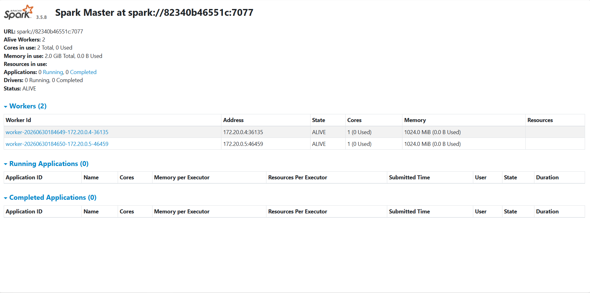
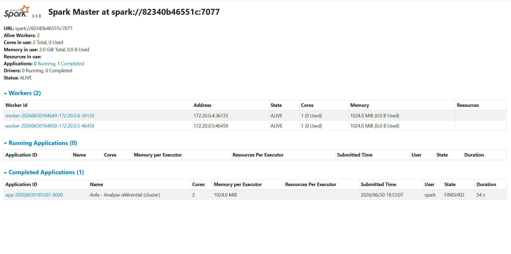
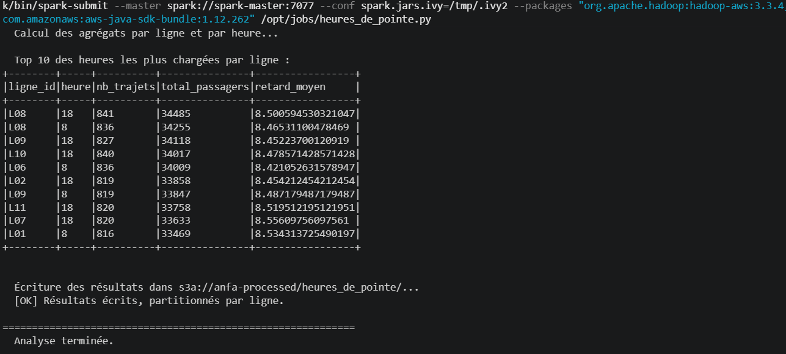
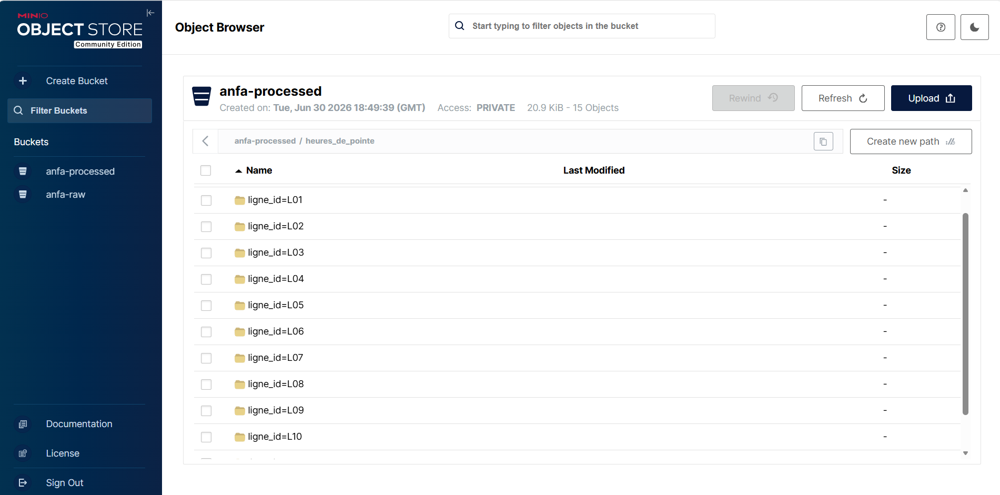

# Rendu Séance 5

**Nom et prénom :** Nancy Montcho
**Identifiant GitHub :** MontchoNancy

## Résumé de la séance

Cette cinquième séance a permis de passer du mode local de PySpark (séance 2) à un véritable cluster Spark distribué : un master et deux workers déployés via Docker Compose. J'ai uploadé le référentiel d'Anfa dans MinIO, soumis un premier job distribué calculant des statistiques de base via le connecteur S3A, puis généré un historique simulé de trajets pour exécuter un job métier plus réaliste (calcul des heures de pointe par ligne avec un `groupBy` provoquant un shuffle). Les résultats ont été écrits en Parquet dans la zone `anfa-processed` de MinIO, certains partitionnés par ligne. La séance s'est terminée par une réflexion sur les cas où le mode cluster apporte réellement un gain par rapport au mode local.

## Étapes principales

1. Synchronisation du fork avec le dépôt upstream du cours pour récupérer `seance-05/` (docker-compose.yml + 4 jobs Python), puis création de la branche `seance-05`.
2. Déploiement du cluster Spark standalone (1 master + 2 workers, image `apache/spark:3.5.8-python3`) via Docker Compose, et vérification des 2 workers `ALIVE` dans le dashboard Spark Master (`http://localhost:8080`).
3. Préparation de MinIO : création des buckets `anfa-raw` et `anfa-processed`, création d'une clé applicative de service (`anfa-app-key`), puis upload du référentiel CSV dans `anfa-raw/referentiel/` via `upload_referentiel.py`.
4. Soumission du premier job distribué `analyse_referentiel_cluster.py` avec `spark-submit`, configuré pour lire les CSV depuis MinIO via le connecteur S3A et écrire les résultats agrégés en Parquet dans `anfa-processed/bus_par_ligne/`.
5. Génération d'un historique simulé de ~75 000 à 100 000 trajets (`generer_trajets.py`) avec une distribution réaliste des heures de pointe (pics 7-8h et 17-18h).
6. Soumission du job `heures_de_pointe.py` : extraction de l'heure depuis le timestamp, agrégation par `(ligne_id, heure)` (groupBy → shuffle), écriture en Parquet partitionné par `ligne_id` dans `anfa-processed/heures_de_pointe/`.
7. Comparaison subjective entre mode local (séance 2) et mode cluster sur le volume de données manipulé.
8. Arrêt propre de la stack avec `docker compose down` en conservant les volumes MinIO.

## Captures d'écran

### Dashboard Spark Master avec 2 workers

### Application Spark exécutée avec succès

### Résultats du Top 10 dans la console

### Bucket anfa-processed avec heures_de_pointe partitionné

## Réflexion : local vs cluster

Sur le volume manipulé en TP (~75 000 trajets), la différence entre le mode local de la séance 2 et le mode cluster de cette séance n'est pas spectaculaire — le cluster n'a pas semblé nettement plus rapide, voire légèrement plus lent sur certaines exécutions. C'est cohérent avec ce qui était annoncé : à ce volume, l'overhead de communication entre le Driver et les Executors (sérialisation, réseau, coordination) coûte plus cher que ce que le parallélisme à 2 workers apporte réellement.

Ce qui change concrètement entre les deux modes :
- En local, tout tourne dans un seul processus JVM sur ma machine : simple, rapide à démarrer, mais limité par la RAM et le CPU disponibles, et sans tolérance aux pannes.
- En cluster, le job est visible dans le dashboard Spark Master (Running puis Completed Applications), avec un vrai découpage en stages et tâches observable dans le DAG — une expérience beaucoup plus proche de ce qui se passerait en production avec des données massives.

Dans quel cas j'utiliserais l'un ou l'autre : le mode local reste pertinent pour le développement, le débogage rapide et les jeux de données qui tiennent confortablement en mémoire sur une seule machine (comme le référentiel de 4 CSV). Le mode cluster devient nécessaire dès que le volume dépasse les capacités RAM d'une seule machine, ou quand on veut profiter de la tolérance aux pannes et du parallélisme réel — typiquement pour traiter l'historique complet d'un semestre de trajets et de validations plutôt qu'un échantillon simulé de quelques dizaines de milliers de lignes.

## Réponses aux exercices d'application

<À compléter d'après les énoncés fournis avec l'assignment — si tu as le PDF des exercices de la séance 5, envoie-le-moi et je rédige les réponses comme pour les séances précédentes.>

## Difficultés rencontrées

- **Synchronisation du fork (`upstream` manquant)** : le remote `upstream` n'était pas configuré sur mon dépôt local. Résolu en récupérant `seance-05/` directement via l'interface GitHub (bouton "Sync fork" → "Update branch"), puis `git pull` en local.
- **Commandes multi-lignes avec `\` dans PowerShell** : comme pour les séances précédentes, les commandes longues fournies dans le TP avec des `\` de continuation (Linux) ne fonctionnent pas telles quelles sous PowerShell. Résolu en remettant chaque commande `docker exec` / `spark-submit` sur une seule ligne.
- **<Ajouter ici toute autre difficulté rencontrée pendant l'exécution effective des jobs, ex. temps de téléchargement des packages Maven, RAM Docker insuffisante, etc.>**
