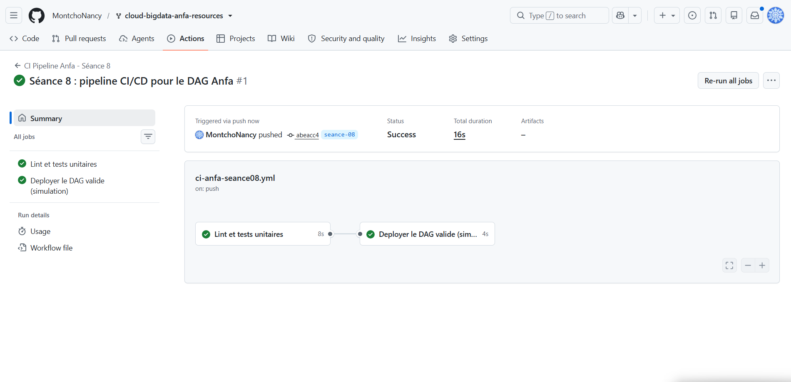
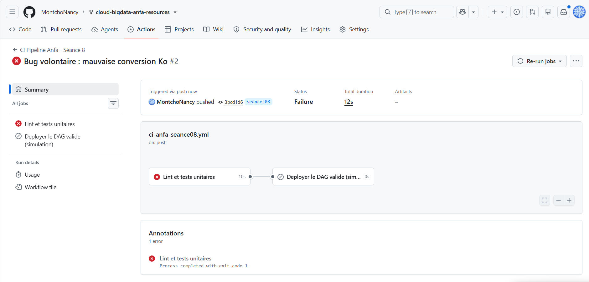

# RENDU — Séance 8 : CI/CD pour les pipelines data

**Nom :** MONTCHO Nancy
**Identifiant GitHub :** MontchoNancy
**Cours :** Cloud & Big Data — ESGIS Master 1 IA/BD
**Enseignant :** Denis AKPAGNONITE

---

## Résumé

Cette séance avait pour objectif de mettre en place un pipeline d'intégration continue (CI/CD) pour le DAG Airflow `dag_anfa_quotidien` développé en séance 6. L'idée centrale était de séparer la logique métier du DAG (vérification des fichiers, construction des messages de notification) des objets propres à Airflow, afin de pouvoir la tester automatiquement sans avoir à installer Airflow dans l'environnement de CI, ce qui serait beaucoup trop lourd et lent pour une simple validation de code.

Cette logique métier a été isolée dans un module Python indépendant, `anfa_logic.py`, constitué de fonctions pures (sans réseau, sans objet Airflow), ce qui les rend testables avec `pytest` sans dépendance externe. Un fichier de tests unitaires, `test_anfa_logic.py`, valide le comportement de ces fonctions, notamment le calcul du nombre de fichiers et de la taille totale des résultats produits par le pipeline.

Un workflow GitHub Actions (`ci-anfa-seance08.yml`) a ensuite été configuré pour s'exécuter automatiquement à chaque push sur la branche `seance-08`. Il comprend deux jobs séquentiels : `valider-dag`, qui exécute le lint (`flake8`) puis les tests unitaires (`pytest`), et `deployer`, qui simule un déploiement mais qui ne s'exécute que si `valider-dag` a réussi.

## Étapes principales

1. Récupération des fichiers de référence depuis le dépôt du cours (`upstream`) et synchronisation du fork, création de la branche `seance-08`.
2. Lecture et compréhension du module `anfa_logic.py` : fonctions pures testables sans Airflow.
3. Lecture du DAG `dag_anfa_quotidien.py` simplifié, qui importe cette logique déjà testée.
4. Lecture des tests unitaires `test_anfa_logic.py`, avec une attention particulière portée au commentaire `# noqa: E402`, nécessaire car `sys.path` doit être modifié avant l'import du module `anfa_logic`, ce qui placerait normalement l'import après du code — chose que `flake8` signale par défaut.
5. Exécution des tests en local avec `pytest tests/ -v` avant tout push, pour valider que tout fonctionnait avant de déclencher la CI.
6. Lecture du workflow `.github/workflows/ci-anfa-seance08.yml` : déclenchement sur push et pull request ciblant `seance-08`, filtré aux changements dans `seance-08/**`, avec les deux jobs `valider-dag` et `deployer` (ce dernier dépendant du succès du premier via `needs`).
7. Commit et push du code sur la branche `seance-08`, déclenchant automatiquement le pipeline dans l'onglet Actions de GitHub.
8. Observation du pipeline réussi : les deux jobs `valider-dag` et `deployer` passent au vert.
9. Introduction volontaire d'un bug dans `verifier_liste_fichiers` (division par `1000` au lieu de `1024` pour le calcul en kilo-octets), puis nouveau push.
10. Observation de l'échec du pipeline : le job `valider-dag` échoue au niveau du test `test_verifier_liste_fichiers_calcule_correctement`, car la valeur obtenue (3.1) ne correspond plus à la valeur attendue (3.0). Le job `deployer` ne s'exécute pas.

## Difficultés rencontrées

La principale difficulté a été de comprendre pourquoi le workflow n'apparaissait pas dans l'onglet Actions après avoir suivi les étapes de la Partie 0 : les fichiers étaient bien présents dans le dépôt (récupérés via le merge avec `upstream/main`), mais aucun événement de push n'avait encore eu lieu sur la branche `seance-08` après l'ajout du workflow. GitHub Actions ne se déclenche que sur un véritable événement Git (push, pull request), pas simplement parce que les fichiers existent dans le dépôt. Il a donc fallu effectuer un commit explicite touchant le dossier `seance-08/` pour déclencher la toute première exécution.

Une seconde difficulté, mineure, a été de veiller à ne pas confondre les branches locales : plusieurs branches de séances précédentes coexistant dans le dépôt (`seance-06`, `seance-07`, `seance-09`...), il fallait s'assurer d'être positionnée sur `seance-08` avant chaque commit, avec `git branch` et `git status`.

## Réflexion personnelle

Ce TP m'a permis de comprendre concrètement pourquoi on isole la logique métier des objets techniques d'un framework comme Airflow : cela rend le code testable rapidement, sans dépendance lourde, ce qui est essentiel pour une CI rapide et fiable. Voir le pipeline bloquer automatiquement le déploiement dès qu'un test échoue — exactement comme cela aurait dû arriver pour le bug de Mawuli dans la situation-problème du cours — rend très concret l'intérêt du CI/CD : un changement cassé ne peut plus atteindre la production silencieusement. C'est un vrai changement de discipline par rapport aux déploiements manuels que nous avons pratiqués depuis la séance 1.

## Captures d'écran

### Pipeline réussi (les 2 jobs verts)

### Pipeline en échec après introduction du bug

