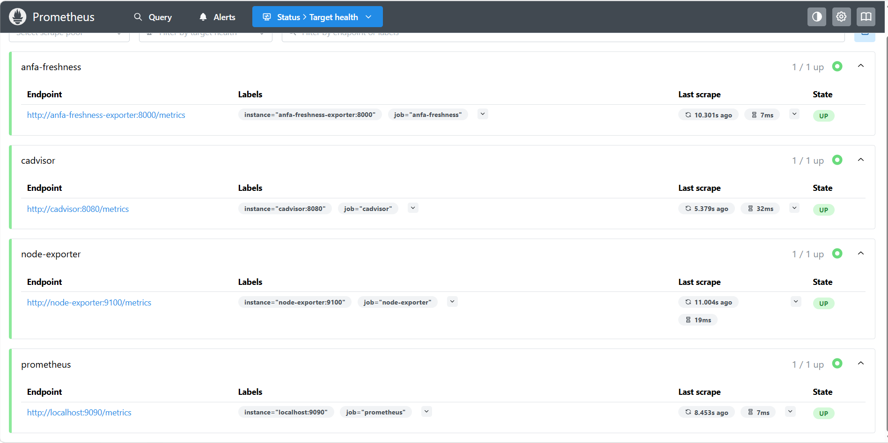
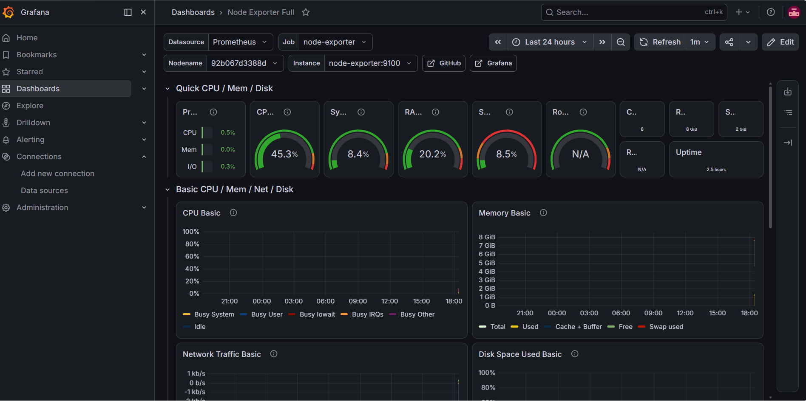
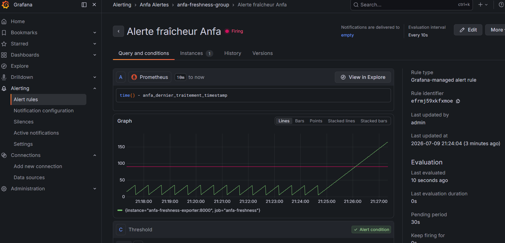

# RENDU — Séance 9 : Monitoring et observabilité

**Nom :** MONTCHO Nancy
**Identifiant GitHub :** MontchoNancy
**Cours :** Cloud & Big Data — ESGIS Master 1 IA/BD

---

## Résumé

Cette séance avait pour objectif de mettre en place une stack de monitoring complète pour la plateforme Anfa, à l'aide de Prometheus (collecte de métriques) et Grafana (visualisation et alerting). L'idée centrale, illustrée par la situation-problème du cours (le cas d'Awa), est qu'un pipeline peut fonctionner sans erreur apparente tout en étant silencieusement dégradé — par exemple en traitant des données obsolètes. La seule façon de détecter ce type de panne est de surveiller la fraîcheur des données, et non uniquement l'état "Running" des composants.

La stack déployée via `docker compose up -d --build` comprend cinq services : Prometheus (collecte, port 9090), Node Exporter (métriques système), cAdvisor (métriques des conteneurs), un exportateur métier personnalisé `anfa-freshness-exporter` (fraîcheur des données Anfa, port 8000), et Grafana (visualisation, port 3000). La source de données Prometheus est provisionnée automatiquement dans Grafana au démarrage, sans configuration manuelle.

Un dashboard Grafana préconstruit ("Node Exporter Full", ID 1860) a été importé pour visualiser les métriques système standard (CPU, mémoire, disque, réseau). Un second dashboard personnalisé, "Anfa - Monitoring pipeline", a été créé avec un panneau de type jauge affichant la métrique `time() - anfa_dernier_traitement_timestamp`, c'est-à-dire le nombre de secondes écoulées depuis le dernier traitement réussi. Des seuils de couleur (vert à 0s, orange à 60s, rouge à 120s) rendent l'état du pipeline immédiatement lisible.

Une règle d'alerte Grafana a ensuite été configurée sur ce panneau : la condition se déclenche si la fraîcheur dépasse 90 secondes, évaluée toutes les 10 secondes, avec une période d'attente (`for`) de 30 secondes avant passage à l'état Firing. Une panne a été simulée en créant un fichier sentinelle (`/tmp/anfa_en_panne`) dans le conteneur de l'exportateur, sans arrêter le conteneur lui-même — ce qui a permis d'observer la jauge grimper en continu et l'alerte passer de Normal à Pending puis à Firing, avant de revenir à la normale une fois la panne "réparée".

## Étapes principales

1. Récupération des fichiers de référence (`docker-compose.yml`, `prometheus.yml`, `exporter/`, `provisioning/`) depuis le dépôt du cours, création de la branche `seance-09`.
2. Lecture de l'exportateur `anfa_freshness_exporter.py` : un `Gauge` Prometheus exposant l'horodatage du dernier traitement Anfa réussi, avec simulation de panne via un fichier sentinelle plutôt qu'un arrêt du conteneur, pour préserver la série de métriques.
3. Lancement de la stack avec `docker compose up -d --build`, vérification que les 5 conteneurs sont `Up` via `docker compose ps`.
4. Vérification dans Prometheus (`http://localhost:9090` → Status → Targets) que les 4 cibles (`prometheus`, `node-exporter`, `cadvisor`, `anfa-freshness`) sont à l'état UP.
5. Exécution de la requête PromQL `time() - anfa_dernier_traitement_timestamp` dans l'onglet Graph : observation d'un motif en dents de scie, la fraîcheur remontant à zéro toutes les 30 secondes.
6. Connexion à Grafana (`http://localhost:3000`, `admin`/`admin`), vérification que la source de données Prometheus est déjà provisionnée.
7. Import du dashboard "Node Exporter Full" (ID 1860) avec la source Prometheus.
8. Création d'un nouveau dashboard "Anfa - Monitoring pipeline" avec un panneau de type Gauge, requête `time() - anfa_dernier_traitement_timestamp`, seuils 0/60/120 (vert/orange/rouge).
9. Création d'une règle d'alerte Grafana sur ce panneau : condition `WHEN last() OF query (A) IS ABOVE 90`, groupe d'évaluation dédié (intervalle 10s), pending period 30s, dossier `Anfa Alertes`, contact point par défaut.
10. Simulation de la panne avec `docker exec anfa-freshness-exporter touch /tmp/anfa_en_panne`, observation de la jauge grimpant en continu (vert → orange → rouge) et de l'alerte passant de Normal à Pending puis à Firing.
11. Réparation avec `docker exec anfa-freshness-exporter rm -f /tmp/anfa_en_panne`, retour à la normale de la jauge et de l'alerte en moins d'une minute.
12. Arrêt propre de la stack avec `docker compose down`.

## Difficultés rencontrées

La principale difficulté a été de localiser l'onglet de création d'alerte directement depuis l'éditeur de panneau : dans la version de Grafana utilisée, il n'existe plus d'onglet "Alert" intégré à l'édition du panneau comme décrit dans certaines documentations plus anciennes. Il a fallu passer par le menu latéral **Alerting → Alert rules → New alert rule**, puis reconstruire manuellement la requête PromQL et la condition de seuil dans ce formulaire dédié, plutôt que de partir directement du panneau existant.

Une seconde difficulté a été de créer le groupe d'évaluation (evaluation group) avant de pouvoir définir un `Pending period` cohérent : Grafana refuse une période d'attente inférieure à l'intervalle d'évaluation, ce qui imposait de créer d'abord un groupe avec un intervalle de 10 secondes avant de pouvoir valider le `for` de 30 secondes.

Enfin, comme aucun vrai contact point n'était configuré (l'objectif du TP étant uniquement d'observer le changement d'état de l'alerte, pas de recevoir une notification réelle), il a fallu sélectionner explicitement l'option "empty" (`<empty contact point>`) pour pouvoir enregistrer la règle.

## Réflexion personnelle

Ce TP illustre très concrètement la différence entre "le système tourne" et "le système fonctionne correctement". Voir la jauge de fraîcheur grimper sans qu'aucun conteneur ne plante, sans aucune erreur dans les logs, rend tangible la situation-problème d'Awa : un pipeline peut sembler parfaitement sain du point de vue de l'infrastructure tout en étant silencieusement inutile. La métrique de fraîcheur, couplée à une alerte à seuil, est précisément ce qui aurait permis de détecter ce type d'incident en quelques dizaines de secondes plutôt qu'un lendemain matin. Cela renforce aussi le lien avec la séance précédente sur le CI/CD : tester avant de déployer évite certains bugs, mais surveiller après le déploiement est tout aussi indispensable, car certains problèmes n'apparaissent qu'en production, sur la durée.

## Captures d'écran

### Les 4 cibles Prometheus à l'état UP

### Dashboard Grafana "Node Exporter Full"

### Alerte de fraîcheur à l'état "Firing" pendant la panne simulée

